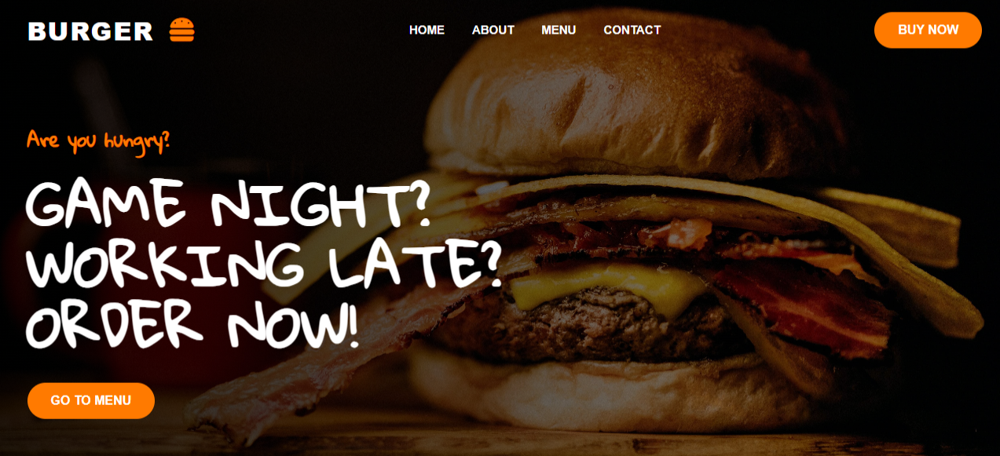

# 🍔 BURGER HOUSE - فروشگاه آنلاین همبرگر
لینک سایت
Git hub pages : https://mediproten.github.io/BURGER-SITE-DEMO

Versel : https://burger-site-eight.vercel.app

> یک وب‌سایت رستوران همبرگر با طراحی مدرن، کاملاً ریسپانسیو و کاربرپسند

## 📸 پیش‌نمایش

## ✨ ویژگی‌ها

- ✅ طراحی کاملاً ریسپانسیو - سازگار با تمام دستگاه‌ها (موبایل، تبلت، دسکتاپ)
- ✅ صفحات کامل - صفحه اصلی، درباره ما، منو، تماس با ما
- ✅ فیلتر منو - نمایش دسته‌بندی‌های مختلف غذا
- ✅ فرم تماس - فرم ارسال پیام با اعتبارسنجی
- ✅ لودینگ صفحه - انیمیشن لودینگ حرفه‌ای با افکت بلور
- ✅ نقشه گوگل - نمایش موقعیت رستوران
- ✅ انیمیشن‌های نرم - افکت‌های هاور و ترنزیشن‌های روان
- ✅ تایپوگرافی زیبا - استفاده از فونت‌های گوگل
- ✅ آیکون‌های Font Awesome - آیکون‌های حرفه‌ای
- ✅ سئو دوستانه - ساختار HTML استاندارد

## 🛠️ تکنولوژی‌های استفاده شده

| تکنولوژی | توضیحات |
|-----------|----------|
| HTML5 | ساختار اصلی صفحات |
| CSS3 | استایل‌دهی و انیمیشن‌ها |
| JavaScript | تعاملات و رویدادها |
| Font Awesome | آیکون‌های حرفه‌ای |
| Google Fonts | فونت‌های زیبا و متنوع |
| Git | کنترل نسخه |
| GitHub Pages | هاستینگ استاتیک |
| Vercel | دیپلوی سریع |

